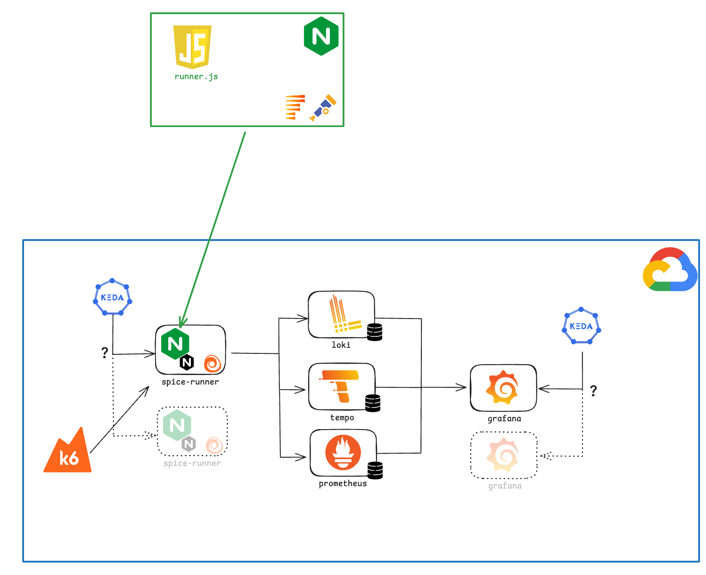

# Spice Runner

This is a demo project created by me ([Nicole van der Hoeven](https://nicolevanderhoeven.com)) for my talk at [Øredev 2025](https://oredev.org/) in Malmö, Sweden, on November 5th, 2025. The talk is called _"The Spice Must Flow: The Fremen Guide to Sustainable Observability"._ You can find my slides [here](https://nicole.to/spiceslides). See the very end of this README for some references I used in the slides. Below is the abstract of the talk.

> Nobody wants to be wasteful. But how do you balance that with the need for enough data to fix things when they go wrong? After all, no matter how much it costs, there are SLOs to keep. The spice-- the telemetry-- must flow.
>
> The Fremen are a people who live on the planet Arrakis, simultaneously rich in spice while poor in water. But the Fremen have managed to thrive, not just survive, on very little while continuing to produce spice. What would it take to apply this "desert planet thinking" to observability?
> 
> In this talk, you'll learn about the hidden environmental and financial costs of your observability stack and how to reduce them. You'll learn about the complications of measuring cost for ephemeral resources on Kubernetes, how to use KEDA to "right-size" resources when you don't know what the right size is, and how to convince your teams to drop all but the most meaningful telemetry data. In the end, the spice must flow, but there must still be enough water to sustain all.

The Spice Runner game is a Dune-themed browser game with full observability and advanced autoscaling capabilities. This project demonstrates production-grade Kubernetes deployment patterns with comprehensive monitoring and intelligent scaling.


You can deploy this game yourself, or play it at [nvdh.dev/spice](https://nicole.to/spicegame).

## Features

This project includes the following features:

- **Interactive Game**: Dune-themed endless runner browser game
- **Full Instrumentation**: [Faro](https://nicole.to/farorepo) for frontend instrumentation, [Alloy](https://nicole.to/alloyrepo) for telemetry collection
- **Full Observability**: Metrics, logs, and traces with [Prometheus](https://nicole.to/promrepo), [Loki](https://nicole.to/lokirepo), and [Tempo](https://nicole.to/temporepo)
- **Pod Autoscaling**: Pod autoscaling based on HTTP traffic, CPU, and memory with [KEDA](https://nicole.to/kedarepo)
- **Cluster Autoscaler**: Automatic node provisioning based on pending pods with [GKE Cluster Autoscaler](https://nicole.to/gkeautoscaler)
- **Real-time Monitoring**: [Grafana](https://nicole.to/grafanarepo)
- **Energy Monitoring**: [Kepler](https://nicole.to/keplerrepo) integration for power consumption and energy tracking
- **Load Testing**: [k6](https://nicole.to/k6repo) for load testing

## Architecture

The application uses a multi-layer architecture with integrated observability and autoscaling:



## Quick start

This guide helps you deploy the Spice Runner game to Google Kubernetes Engine (GKE) with full observability and autoscaling.

Before you begin, ensure you have the following:

- A GKE cluster running
- `kubectl` configured to access your cluster
- `gcloud` CLI installed and authenticated

### Deploy to GKE

To deploy the application to GKE, run the following commands:

```bash
# Configure your cluster
export CLUSTER_NAME="spice-runner-cluster"
export REGION="us-central1"
export ZONE="us-central1-a"
export GCP_PROJECT_ID=$(gcloud config get-value project)

# Create Grafana admin credentials secret
kubectl create secret generic grafana-admin-credentials \
  --from-literal=admin-user=admin \
  --from-literal=admin-password=YOUR_PASSWORD_HERE \
  -n observability \
  --dry-run=client -o yaml | kubectl apply -f -

# Deploy the observability stack
kubectl apply -f k8s/observability-stack.yaml

# Deploy the application
kubectl apply -f k8s/deployment-cloud-stack.yaml
kubectl apply -f k8s/service.yaml

# Apply KEDA autoscaling
kubectl apply -f k8s/keda-scaledobject.yaml

# Enable GKE Cluster Autoscaler
gcloud container clusters update $CLUSTER_NAME \
  --enable-autoscaling \
  --node-pool=default-pool \
  --min-nodes=1 \
  --max-nodes=10 \
  --zone=$ZONE
```

## Autoscaling

The application supports two levels of autoscaling to handle varying workloads efficiently.

### KEDA (Pod autoscaling)

KEDA provides horizontal pod autoscaling based on multiple metrics:

- **Min replicas**: 1
- **Max replicas**: 10 (can be increased)
- **Triggers**: HTTP request rate, CPU utilization, memory utilization

For setup details, refer to the [KEDA testing guide](docs/KEDA-TESTING.md).

### GKE Cluster Autoscaler (Node Autoscaling)

GKE Cluster Autoscaler provides production-ready node autoscaling:

- **Automatic node provisioning**: Adds nodes when pods cannot be scheduled
- **Node removal**: Removes underutilized nodes to save costs
- **Production-ready**: Fully supported by Google
- **Configuration**: Configured for min 1 node, max 10 nodes
- **Seamless integration**: Works automatically with KEDA pod autoscaling

## Testing

You can test the autoscaling behavior using automated load tests or manual scaling.

### Load testing

To run automated load tests, use the following commands:

```bash
# KEDA load tests
./scripts/run-hpa-test.sh
```

### Manual testing

To manually test scaling behavior, run the following commands:

```bash
# Scale up
kubectl scale deployment spice-runner --replicas=20

# Watch autoscaling
kubectl get pods -w
kubectl get nodes -w
```

## Documentation

The following documentation provides detailed guides for setup, configuration, and operations.

### Autoscaling

- [KEDA quickstart](docs/KEDA-QUICKSTART.md) - Quick KEDA setup
- [KEDA testing guide](docs/KEDA-TESTING.md) - KEDA testing procedures
- [HPA testing guide](docs/HPA-TESTING.md) - Horizontal Pod Autoscaler guide
- [Pod-per-session scaling](docs/POD-PER-SESSION-SCALING.md) - Advanced scaling patterns
- [GKE cluster autoscaler](docs/GKE-CLUSTER-AUTOSCALER.md) - Node-level autoscaling configuration
- [Observability and autoscaling](docs/OBSERVABILITY-AUTOSCALING.md) - Integration guide

### Monitoring and operations

- [Kubernetes monitoring setup](docs/K8S-MONITORING.md) - Kubernetes monitoring configuration
- [Kubernetes Dashboard guide](docs/KUBERNETES-DASHBOARD-GUIDE.md) - Dashboard usage
- [Pod-per-session monitoring](docs/POD-PER-SESSION-MONITORING.md) - Session-based monitoring
- [Kepler deployment summary](docs/KEPLER-DEPLOYMENT-SUMMARY.md) - Energy monitoring deployment
- [Kepler guide](docs/KEPLER-GUIDE.md) - Power consumption monitoring

### Setup and configuration

- [Implementation summary](docs/IMPLEMENTATION-SUMMARY.md) - Implementation overview

## Project structure

The project is organized as follows:

```
spice-runner/
├── k8s/                           # Kubernetes manifests
│   ├── deployment-cloud-stack.yaml    # Main deployment
│   ├── service.yaml                   # Service definition
│   ├── keda-scaledobject.yaml        # KEDA autoscaling
│   ├── observability-stack.yaml      # Grafana, Prometheus, Loki, Tempo
│   ├── kepler.yaml                   # Kepler energy monitoring
│   └── kepler-dashboard.yaml         # Kepler Grafana dashboard
├── scripts/                       # Automation scripts
│   ├── install-keda.sh               # Install KEDA
│   ├── deploy-kepler.sh              # Deploy Kepler
│   ├── run-hpa-test.sh               # Run KEDA tests
│   ├── hpa-load-test.js              # Load testing
│   ├── mega-spike-test.js            # Spike testing
│   └── ultimate-demo-test.js         # Comprehensive demo
├── img/                           # Game graphics
├── index.html                     # Game frontend
├── nginx.conf                     # NGINX configuration
└── Dockerfile                     # Container image

```

## Monitoring URLs

After you deploy the application, you can access the following services:

- **Game**: `http://<YOUR_DOMAIN>/spice/`
- **Grafana**: Access via LoadBalancer IP (requires login with credentials set during deployment)
  - Get IP: `kubectl get service grafana -n observability`
  - Default username: `admin`
  - Password: Set via the `grafana-admin-credentials` secret
  - **Kepler Dashboard**: Available in Grafana under "Energy" folder - "Kepler Energy & Power Consumption"
- **Prometheus**: `http://prometheus.observability.svc.cluster.local:9090`

## Cost Optimization

GKE Cluster Autoscaler helps optimize costs automatically:

- **Automatic scaling**: Adds nodes only when needed, removes when idle
- **Resource efficiency**: Right-sizes the cluster based on actual demand  
- **Cost savings**: Reduces waste by scaling down during low traffic
- **Configuration**: Adjust `--min-nodes` and `--max-nodes` to control costs

To further optimize:
- Set appropriate resource requests and limits on pods
- Use preemptible/spot node pools for non-critical workloads
- Monitor usage and adjust autoscaling parameters

## Troubleshooting

This section helps you diagnose and resolve common issues.

### Pods not scaling

To diagnose pod scaling issues, run the following commands:

```bash
# Check KEDA
kubectl get scaledobject
kubectl describe scaledobject spice-runner-keda

# Check metrics
kubectl get --raw /apis/external.metrics.k8s.io/v1beta1
```

### Nodes Not Scaling

If nodes aren't being added when pods are pending:

```bash
# Check cluster autoscaler status
kubectl get events --all-namespaces | grep -i autoscal

# Check node pool autoscaling configuration
gcloud container node-pools describe default-pool \
  --cluster=CLUSTER_NAME \
  --zone=ZONE
```

### High costs

If you experience unexpectedly high costs, take the following actions:

- Review instance types: Run `kubectl get nodes -o wide` to see active node types
- Check NodePool limits: Run `kubectl get nodepools -o yaml` to verify configuration
- Set up billing alerts in GCP Console to monitor spending

### Grafana login issues

If you cannot log into Grafana:

```bash
# Verify the secret exists
kubectl get secret grafana-admin-credentials -n observability

# Check if Grafana is using the secret
kubectl describe deployment grafana -n observability | grep -A 5 "Environment"

# Reset the password if needed
kubectl delete secret grafana-admin-credentials -n observability
kubectl create secret generic grafana-admin-credentials \
  --from-literal=admin-user=admin \
  --from-literal=admin-password=NEW_PASSWORD_HERE \
  -n observability

# Restart Grafana to pick up new credentials
kubectl rollout restart deployment/grafana -n observability
```

## References

- [Electricity map per country](https://app.electricitymaps.com/map/)
- [GCP Carbon Data Across Google Regions](https://cloud.google.com/sustainability/region-carbon)
- CNCF TAG: Environmental Sustainability: [repo](https://nicole.to/tagenv)
- (blog) How Grafana Labs switched to Karpenter to reduce costs and complexities in Amazon EKS: [blog](https://nicole.to/karpenter)
- Statistics on data centre energy usage: O'Brien, I (2024). *Data center emissions probably 662% higher than big tech claims. Can it keep up the ruse?* Retrieved from The Guardian in October 2025: https://www.theguardian.com/technology/2024/sep/15/data-center-gas-emissions-tech
- Statistics on global energy consumption: Ritchie, H., Rosado, P., & Roser, M. (2020). *Energy production and consumption*. Our World in Data. Retrieved in October 2025 from https://ourworldindata.org/energy-production-consumption

### Images

- Dune Art Wallpaper, HD Movies 4K Wallpapers, Images and Background - Wallpapers Den: [wallpapersden.com](https://wallpapersden.com/dune-art-wallpaper/)
- Sci Fi Dune Planet, HD wallpaper: https://www.peakpx.com
- Mystery of the Spacing Guild in Lynch's 'Dune' Movie: https://dunenewsnet.com/2024/03/the-spacing-guild-mystery-david-lynch-dune-movie/
- The Dune: Prophecy TV Series Is Doing Much More Than Setting Up the Bene Gesserit: https://www.ign.com/articles/the-dune-prophecy-tv-series-is-doing-much-more-than-setting-up-the-bene-gesserit
- Discovering the Fremen, Part 2: ‘Dune’s Ecologists: https://dunenewsnet.com/2025/03/discovering-the-fremen-ecologists-of-dune/
- How Dune created the sinister sounds of those menacing sandworms: https://ew.com/awards/oscars/dune-sandworm-sound-engineers/
- Dune 2 Trailer Hints At A Tricky Timeline Change: https://www.inverse.com/entertainment/dune-2-trailer-paul-eye-color-future-visions
- Dune: Part Two Makes One Key Change From the Book. The Result Is Brilliant.: https://slate.com/culture/2024/03/dune-part-2-zendaya-chani-timothee-chalamet-paul-book-versus-movie.html
- Fremen Sietch Water Cache: https://www.pinterest.com/pin/fremen-sietch-water-cache-by-mattw--692498880203474723/
- Dune: what the climate of Arrakis can tell us about the hunt for habitable exoplanets: https://theconversation.com/dune-what-the-climate-of-arrakis-can-tell-us-about-the-hunt-for-habitable-exoplanets-225145
- What Is A Mentat In Dune?: https://www.thegamer.com/dune-what-is-a-mentat/

---

**Built with**: Kubernetes, KEDA, GKE Cluster Autoscaler, Grafana Alloy, Prometheus, Loki, Tempo, Kepler, and k6.